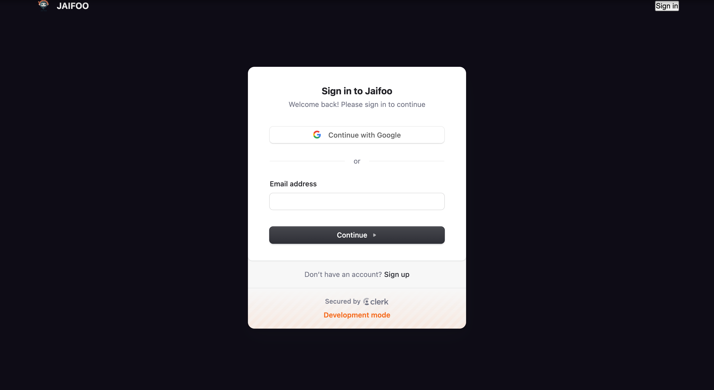
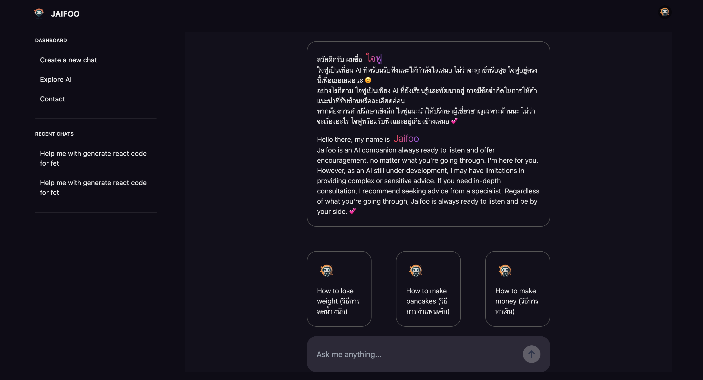
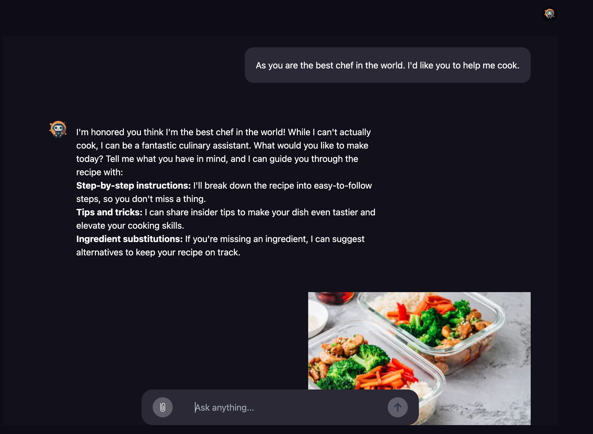
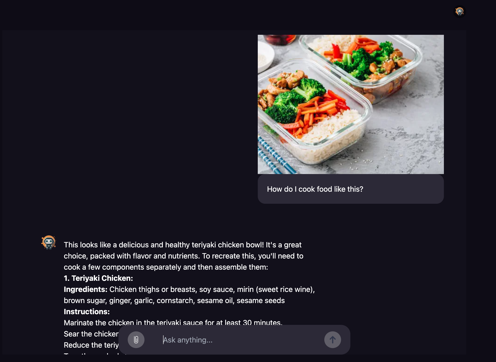
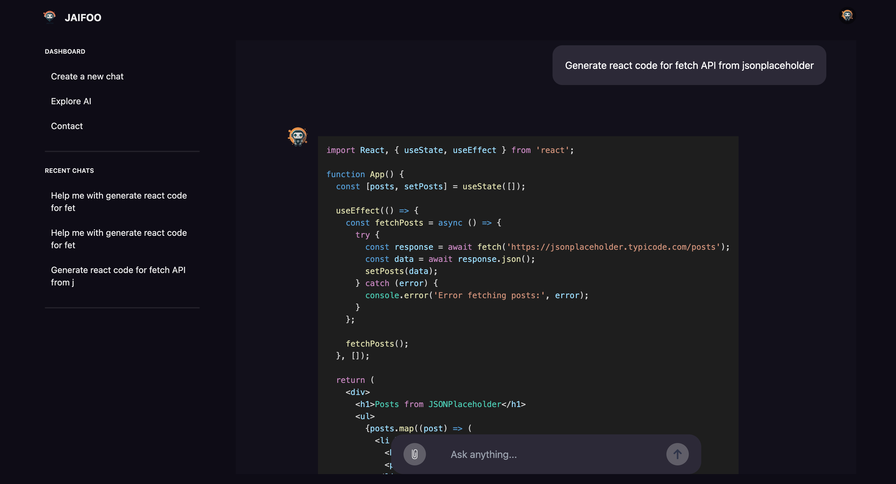

<div align="center">
<br />
  
  <br />
  <h3 align="center">Jaifoo AI Chatbot 🤖</h3>
  <div align="center">
     Jaifoo chatbot app built with MERN Stack (MongoDB, ExpressJS, ReactJS, NodeJS) and Google Generative AI.
    </div>
</div>

## 📋 <a name="table">Table of Contents</a>

1. 🤖 [Introduction](#introduction)
2. ⚙️ [Tech Stack](#tech-stack)
3. 🔋 [Features](#features)
4. 🚀 [More](#more)

## <a name="introduction">🤖 Introduction</a>
```Jaifoo``` is a chatbot application developed using the MERN Stack (MongoDB, ExpressJS, ReactJS, NodeJS) and Google Generative AI. It enables users to create intelligent chatbots efficiently with minimal coding. This application incorporates both the bot's artificial intelligence component and chat management system, while also supporting seamless integration of REST APIs and JavaScript function calls. This versatility results in a wide range of powerful functionalities. ```Jaifoo``` comes equipped with numerous features, including learning capabilities, memory retention, topic-based conversation handling, and image-based conversations.

## <a name="tech-stack">⚙️ Tech Stack</a>

- **Programming language:** HTML, CSS, Javascript
- **Library & Framwork:** ReactJS, NodeJS, ExpressJS, Clerk, Tanstack, Tailwind, DaisyUI
- **Database:** NoSQL, MongoDB
- **Generative AI:** Google Generative AI (Google Gemini 1.5 Flash)
- **Tools** VSCode, Git and Github

## <a name="features">🔋 Features</a>

👉 Personalized AI chatbot

👉 Conversational memory and Chat History

👉 Prompt Engineering

👉 Chat with image

👉 Markdown message and Highlight code block

## <a name="more">🚀 More</a>
<div>
<p float="left" align="center">
  
  
  
</p>
<p float="left" align="center">
  
  
  
</p>
</div>
